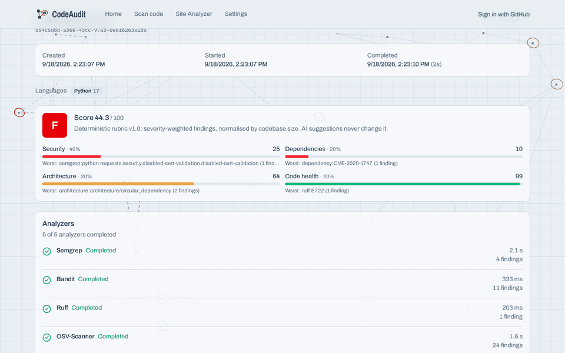
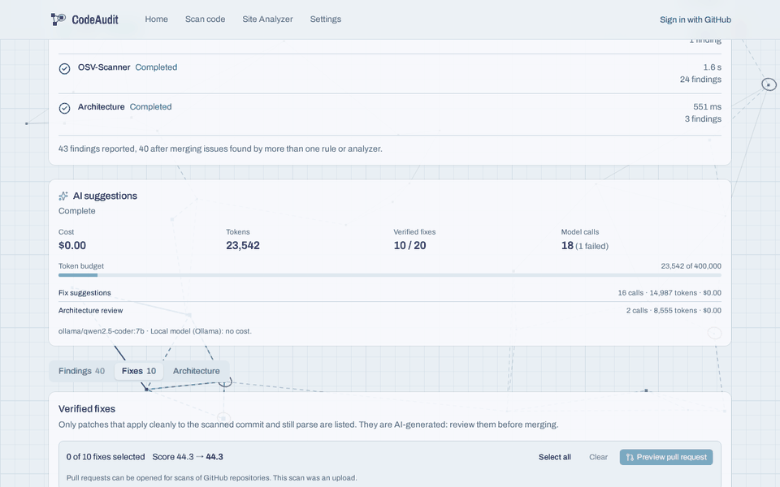
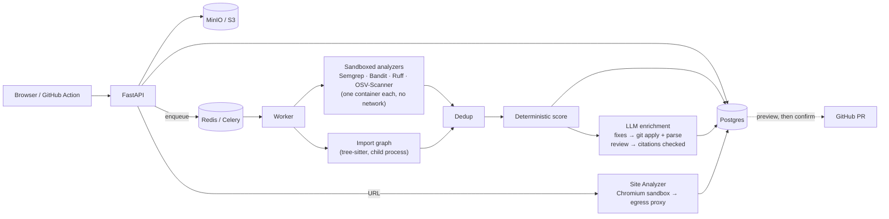

# CodeAudit

[](docs/self-scan.json) — CodeAudit's score for its own code at `38b63f3`, rubric v1.0

Upload a repository or paste a GitHub URL. CodeAudit runs five analyzers in throwaway sandbox containers and builds a module-level import graph. It gives the codebase a deterministic, versioned score (0–100, A–F), and asks an LLM for fixes to the findings worth the most points. **A fix is shown only if it applies cleanly and still parses.** Verified fixes can be opened as a GitHub pull request, and only after you preview and explicitly confirm.

A separate **Site Analyzer** loads a URL in a sandboxed browser. It returns explained phishing/clone risk evidence and the page's design tokens.



## Results, measured

Every number below is regenerated by a committed script from committed data, except where a ⚠ says otherwise. The methodology, the first-pass failures and the diagnoses are in **[docs/validation.md](docs/validation.md)**. ⚠ marks a number with a caveat that changes how far it can be trusted.

| What | Result | How far to trust it |
|---|---|---|
| **Score vs. labelled quality**: Spearman ρ, 20 pinned repos, labels pre-registered | overall **0.66** [95% CI 0.30–0.86]. Security 0.32 · dependencies 0.43 · code health 0.34 · architecture **−0.16** | ⚠ One labeller, n = 20. Separates insecure training apps from maintained code, but **can't yet rank maintained projects against each other**: within groups, ρ is 0.41 among mature repos (n = 9) and −0.32 among tutorials (n = 5), both too noisy to rely on. Four diagnosed fixes reach 0.78 offline, in-sample only, so they aren't shipped. |
| **Patch validation pass rate**: valid ÷ validated patches | **14.5%** (21/145). Dependency bumps 45%, Semgrep fixes 2%. | ⚠ Measured only with the free local model (qwen2.5-coder:7b). The production Claude model hasn't been measured. "Valid" means applies and parses, not correct. |
| **Architecture citation hallucination rate** | **0.0%** (0 of 56 module references; 0 of 38 citations by a stricter count). 3 of 9 reviews failed on invalid JSON. | ⚠ The 7B model mostly restates paths from its input. Small sample. The stored metric misses fabricated edges between real modules (see validation §3). |
| **Phishing detection**, reputation feeds excluded, 188 scored pages (98 phishing, 90 legitimate) | ROC AUC **0.927**. At the UI's *moderate* level: precision **0.949**, recall **0.378**, F1 **0.540**. | Label leakage handled (OpenPhish positives, reputation excluded). The "best F1 0.914" is at threshold ≥ 1 and isn't an operating point. The hand-set signal weights are mis-ordered (§4). |
| **Load**: 20 concurrent uploads of django-rest-framework on a 14-CPU laptop VM | 20/20 completed. Wall clock **44.4 s**, p95 end to end **44.4 s**, **27 scans/min**. | Semgrep CPU is the bottleneck. More sandbox slots made it slower. |
| **CodeAudit on itself** | **74.6 (C)** at `38b63f3`: security 42.7 · dependencies 100 · architecture 88.6 · code health 99.2. 0 critical, 0 error, 67 warnings. | Test fixtures and the demo app (intentionally vulnerable) were excluded. ⚠ Down from 78.5 on 2026-09-17 (as recorded in security-review.md; that raw scan isn't committed): the new `scripts/` and `validation/` tooling (dynamic `urllib`, `subprocess`) costs 4.4 points, and without it the score is 79.0. This is diagnosis #3 again. [`self-scan.json`](docs/self-scan.json) |

<details>
<summary>More demo GIFs</summary>



<!-- PR_GIF -->
</details>

## Quick start

Needs Docker Desktop (Compose ≥ 2.24), and Node ≥ 22.12 for the UI.

```bash
cp .env.example .env                  # then change the passwords
docker compose up -d --build --wait   # API, worker, beat, Postgres, Redis, MinIO, egress proxy
docker compose build web-capture      # the Site Analyzer's browser sandbox image
(cd frontend && npm install && npm run dev)   # http://localhost:5173
```

For LLM suggestions, pick one:
- **Claude:** set `ANTHROPIC_API_KEY`.
- **Free, local:** `brew install ollama && ollama serve & ollama pull qwen2.5-coder:7b`, then set `LLM_PROVIDER=ollama` and `OLLAMA_BASE_URL=http://host.docker.internal:11434` in `.env`.

Without either, everything except fix suggestions and the architecture review still works. For GitHub sign-in and pull requests, register an OAuth app; see [docs/reference.md](docs/reference.md#github-integration).

For a demo that doesn't depend on anything live, run `python scripts/demo/seed.py`, then follow [docs/demo.md](docs/demo.md).

## Architecture



- [docs/architecture.md](docs/architecture.md): the full system diagram, the scan lifecycle sequence, and a map of the components to the code.
- [docs/adr/](docs/adr/): why Semgrep's rules instead of a custom taint engine, why a module-level graph, why per-analyzer failure isolation, why PRs need explicit confirmation.
- [docs/rubric.md](docs/rubric.md): the scoring method in full, including weights, normalisation and curves.
- [docs/security.md](docs/security.md): the threat model, covering untrusted code, SSRF, tokens, the LLM and multi-tenancy.
- [docs/reference.md](docs/reference.md): analyzers, the API, configuration, deployment and operations.

## Limitations

These are stated up front rather than left for someone to discover.

**Coverage**
- **Languages:** Python, JavaScript and TypeScript only. Semgrep and OSV-Scanner run on anything, but the import graph, Bandit and Ruff don't. Code health is scored only for Python (Ruff), so a JS/TS repo gets a score from three categories.
- **Import resolution:** 100% median, 95.3% at worst across the 20 study repos. Non-literal `import()`/`require()`/`import_module` can't be resolved. Flask had 17 relative imports the resolver placed beyond the top-level package. Modules loaded by string (plugins, framework conventions) show up as orphans. Layers are inferred from path names.
- **Dependencies need a lockfile.** OSV-Scanner runs offline with `--no-resolve`, so a repo with only `package.json` or `pyproject.toml` ranges gets **no dependency check, and currently scores 100** for it (validation diagnosis #1).
- **Detector blind spots:** generic hardcoded passwords, some JS DOM sinks, and injections Semgrep's registry rules don't model. For example, DVPWA's SQL injection was reported only by Bandit, and downgraded to *info* for low confidence.

**The score (where the rubric is weakest)**
- **Architecture doesn't rank anything yet (ρ −0.16).** It measures defects that are present, so a 4-module app with no structure scores ~98. Cycles are counted per enumerated cycle, so one tangle in Flask counts 98 times.
- **Dependency scores saturate:** 8 of the 16 repos with vulnerable lockfiles or pinned requirements scored below 1.
- **Examples and docs count as production code:** Express's `examples/` alone drove its security score to 38.
- **Weights are hand-set priors.** Sensitivity analysis shows the ranking depends far more on *counting* choices (repeat damping, what counts as test code) than on the 40/20/20/20 weights.
- **Not a benchmark.** Scores are comparable only within a rubric version, and only between complete scans.

**The LLM**
- **Local 7B model:** it produces an applicable patch 14.5% of the time, and 2–4% for code-level security fixes (Semgrep 1/63, Bandit 1/27). About half of the failures (65 of 124) aren't diffs at all. The validator catches them, and they're shown as "not verified", never offered as fixes.
- **"Valid" isn't "correct":** a patch that applies and parses can still be wrong, and nothing compiles it or runs its tests.
- **Review value is unmeasured:** architecture reviews from the 7B model mostly restate detected cycles and orphans, and 1 in 3 failed on output format.
- **Claude hasn't been evaluated:** there are no measurements with the production model.

**Phishing heuristics**
- Without reputation feeds they catch about 38% of live phishing at the warning level, at 95% precision. Pages on free hosting that copy no brand name mostly slip through.
- The score is a risk heuristic, not a verdict.

**Security** (full list in [docs/security.md](docs/security.md#known-gaps))
- **The Docker socket:** the worker mounts it, which is root-equivalent on the worker host. Analyzers share the host kernel; gVisor is recommended.
- **Suppressions in uploaded code probably still work** for Ruff (`# noqa`), Semgrep (`nosemgrep`, `.semgrepignore`) and OSV-Scanner (`osv-scanner.toml`). That's the tools' documented default behaviour; it hasn't been tested against CodeAudit. Only Bandit's are known to be disabled.
- **Prompt delimiters:** code containing the prompt's closing delimiter can end its code block early. Patches and citations are still validated.
- **API token scope:** `cat_…` tokens can reach admin routes if their owner is an admin.
- **Token rotation:** there's no bulk re-encryption when `TOKEN_ENCRYPTION_KEYS` rotates.

**Operations**
- **Zip uploads with symlinks are rejected.** Two of the 20 study repos (requests, the FastAPI template) could only be scanned by URL.
- **URL scans use GitHub's API anonymously** unless you sign in: 60 requests per hour per IP.
- **Semgrep registry rules are downloaded at scan time** (cached 24 h) and aren't pinned, so scores can drift as rules change. Check the Semgrep Rules License before offering CodeAudit as a hosted service.
