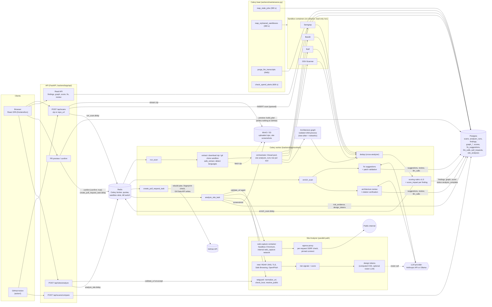
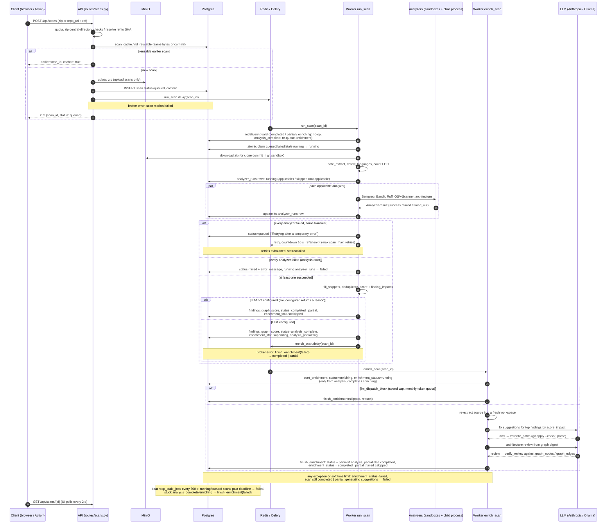

# Architecture

CodeAudit has two independent pipelines that share the API, the Celery workers, Postgres, object storage and the sandbox runner:

- **Code scans**: a zip upload or a GitHub commit is analyzed by sandboxed tools and an architecture graph, deduplicated, scored, and optionally enriched by an LLM.
- **Site Analyzer**: a live URL is captured in a sandboxed browser behind an SSRF-checking egress proxy, then turned into phishing-risk signals and design tokens.

Design decisions are recorded in [`docs/adr/`](adr/README.md).

## System diagram

The beat schedule is defined in `backend/app/core/celery_app.py` (`beat_schedule`).

## Scan lifecycle

Status values come from `ScanStatus` and `EnrichmentStatus` in `backend/app/models/scan.py`. Transitions are in `backend/app/workers/tasks.py` (`run_scan`, `_set_status`, `_queue_enrichment`, `enrich_scan`), `backend/app/services/scan_pipeline.py` (`analyze_and_persist`, `persist_results`) and `backend/app/services/llm/enrichment.py` (`start_enrichment`, `run_enrichment`, `finish_enrichment`).

Notes on the transitions:

- `failed` is also claimable by `run_scan`, so a retried delivery can pick up a scan that `_set_status` marked failed (`claimable` in `run_scan`).
- A scan whose analysis finished is never failed by enrichment. `finish_enrichment` always sets `completed` or `partial` from `scan.analysis_partial`.
- `run_enrichment` decides `enrichment_status`: `partial` if something was produced despite problems, `skipped` if the only problems were budget cuts, `failed` otherwise, and `skipped` when there was nothing to enrich.

## Components

### API

FastAPI app factory in `backend/app/main.py`; routers in `backend/app/api/routes/` (`scans.py`, `compare.py`, `score.py`, `architecture.py`, `llm.py`, `pull_requests.py`, `sites.py`, `auth.py`, `admin.py`, `health.py`). Request body limit in `backend/app/api/middleware.py`, error shape in `backend/app/api/errors.py`, rate limits in `backend/app/api/rate_limit.py`. Scan creation (upload checks, GitHub ref resolution) is in `backend/app/services/scan_creation.py`; archive validation in `backend/app/services/archive.py`; the reuse lookup in `backend/app/services/scan_cache.py`. The API commits the scan row before dispatching `run_scan`.

### Storage and queue

- Postgres models: `backend/app/models/` (`scan.py`, `analyzer_run.py`, `finding.py`, `architecture.py`, `score.py`, `llm.py`, `pull_request.py`, `site_analysis.py`, `user.py`); migrations in `backend/alembic/versions/`.
- Object storage client: `backend/app/core/storage.py`.
- Celery app, `acks_late`, `reject_on_worker_lost`, prefetch 1, beat schedule and worker heartbeat: `backend/app/core/celery_app.py`. Redis client: `backend/app/core/redis_client.py`.

### Worker tasks

`backend/app/workers/tasks.py`: `run_scan`, `enrich_scan`, `regenerate_fix_task`, `create_pull_request_task`, `analyze_site_task`, and `cleanup_after_crash` (on `worker_ready`: removes orphaned sandboxes, stale workspaces, runs the stale-job reaper once). The scan pipeline itself is `backend/app/services/scan_pipeline.py`.

### Sandboxed analyzers

- Interface: `backend/app/services/analyzers/base.py`. Registry (Semgrep, Bandit, Ruff, OSV-Scanner, architecture): `registry.py`. Concurrent, failure-isolated execution: `orchestrator.py`.
- Container runner: `backend/app/services/analyzers/sandbox.py` (`run_in_sandbox`, `run_tool`). Containers run as `nobody`, `network_mode` `none`, read-only root, `cap_drop ALL`, `no-new-privileges`, PID limit, and are always removed. A Redis-backed `SandboxSlot` caps concurrent containers across workers (`MAX_CONCURRENT_SANDBOXES`).
- Tools: `semgrep.py` + `semgrep_rules.py` (registry packs, see [ADR 0001](adr/0001-semgrep-registry-rules-not-custom-taint-engine.md)), `bandit.py`, `ruff.py`, `dependency.py` + `osv_db.py` (offline OSV databases).
- Git clone sandbox (the only container with network): `backend/app/services/github/clone.py`.

### Architecture graph

`backend/app/services/analyzers/architecture.py` runs `backend/app/services/graph/isolated.py` in a child process with a timeout. Pipeline in `backend/app/services/graph/`: `parser.py` (tree-sitter) → `resolver.py` → `builder.py` (module-level NetworkX graph) → `metrics.py` + `layers.py` (cycles, coupling, god modules, layering, orphans) → `persistence.py`. `view.py` groups nodes by directory for the UI. See [ADR 0002](adr/0002-module-level-dependency-graph.md) and [ADR 0003](adr/0003-per-analyzer-failure-isolation.md).

### Dedup and scoring

- Dedup: `backend/app/services/analyzers/dedup.py` with categories from `categories.py`; snippets read from source by `snippets.py`.
- Scoring: `backend/app/services/scoring/rubric.py` (rubric v1.0, `score`, `finding_impacts`, `incomplete` flag), `service.py` (store, rescore, projection), `priority.py` (`top_fixable` for fix suggestions), `backfill.py`.

### LLM enrichment

- Orchestration and status: `backend/app/services/llm/enrichment.py`.
- Client with per-scan token reservation, retries, JSON validation and `llm_calls` logging: `client.py`; Ollama adapter: `ollama.py`; provider chosen by `LLM_PROVIDER` (`backend/app/config.py`, default `anthropic`, model `claude-sonnet-4-6`).
- Fix suggestions: `fix_suggester.py`; patch validation (`validate_patch`): `patches.py`.
- Architecture review and citation verification (`verify_review`): `architect.py`.
- Spend cap and kill switch: `backend/app/services/costs.py`; quotas: `backend/app/services/quotas.py`.

### GitHub pull requests

`backend/app/api/routes/pull_requests.py` (preview, confirm, reads) and `backend/app/services/github/pr_builder.py` (`build_plan`, `save_preview`, `create_pull_request_from_preview`). GitHub REST client: `backend/app/services/github/client.py`. OAuth and token encryption: `backend/app/services/auth/`. See [ADR 0004](adr/0004-pull-requests-require-explicit-confirmation.md).

### Site Analyzer

- Route: `backend/app/api/routes/sites.py` (validates the URL on accept, reuses recent analyses of the same normalized URL).
- Pipeline: `backend/app/services/web/analysis.py` (`run_site_analysis`: re-validate → capture → intel → risk → design tokens).
- SSRF guard: `netguard.py`. Egress proxy (run as the `egress-proxy` compose service): `egress_proxy.py`. Browser sandbox: `capture.py` + `capture_script.py`, image `codeaudit-web-capture` on the internal `codeaudit_web_capture` network (`docker-compose.yml`).
- Signals: `intel.py` (RDAP, DNS, certificate, reputation), `lexical.py`, `brands.py`, `visual.py` + `references.py` (perceptual hashes), `risk.py` (evidence and score). Design tokens: `design.py`, `colors.py`.

### Maintenance

`backend/app/workers/maintenance.py`: `reap_stale_jobs` (scans, enrichments, site analyses, PR creations), `reap_orphaned_sandboxes`, `purge_llm_transcripts`, `check_spend_alerts`.

### Frontend

`frontend/src/router.tsx`, pages in `frontend/src/pages/` (`UploadPage`, `ScanDetailPage`, `SiteAnalyzerPage`, `SiteAnalysisPage`, `SettingsPage`), typed API client in `frontend/src/lib/api.ts`, components in `frontend/src/components/`.
