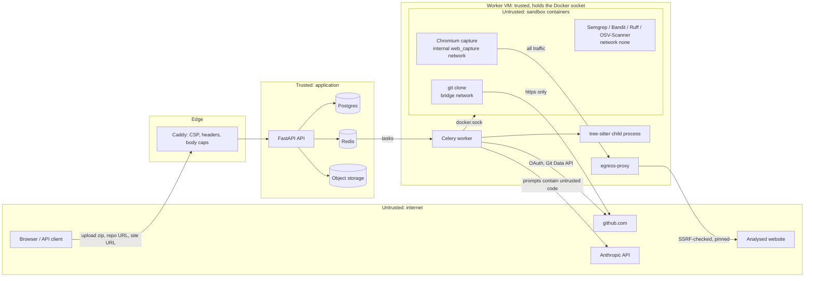

# Threat model

CodeAudit runs third-party tools against code it didn't write, loads web pages chosen by strangers, holds GitHub tokens that can push code, and sends uploaded code to an LLM. This document covers what an attacker could go after, the boundaries they'd have to cross, what stops them (with the code that does it) and what doesn't yet.

For CodeAudit's scan of its own repository, the route-by-route ownership audit and the list of issues found and fixed, see [security-review.md](security-review.md).

Paths below are relative to the repository root. Settings are named by their environment variable; defaults live in `backend/app/config.py`.

## Assets

| Asset | Where it lives | Why it matters |
|---|---|---|
| GitHub OAuth tokens | `github_identities` table, Fernet-encrypted | `repo` scope can read and push to a user's private repositories |
| Session cookies, CSRF tokens, API tokens (`cat_…`) | Only SHA-256 hashes stored (`backend/app/services/auth/crypto.py`) | Act as the user |
| Uploaded code and private-repo clones | Object storage, per-scan workspaces on the worker | Customers' source code |
| Findings, fix suggestions, architecture reviews, LLM transcripts | Postgres | Describe where the customer's code is vulnerable |
| Worker host | Worker VM | Has the Docker socket, which is root-equivalent |
| Cloud metadata and the private network | Worker VM, compose networks | Credentials and internal services reachable by SSRF |
| LLM budget | Anthropic account | Can be spent by anyone who triggers enrichment |
| Secrets in configuration | `ANTHROPIC_API_KEY`, `GITHUB_CLIENT_SECRET`, `TOKEN_ENCRYPTION_KEYS`, database/Redis/S3 credentials | Compromise of any of them leaks the assets above |

## Trust boundaries

The boundaries that matter most:

1. **Client to API.** Everything in a request is untrusted: archives, URLs, hints, IDs.
2. **Worker to sandbox.** Uploaded code, cloned repositories and captured pages are only processed inside sandbox containers, except for zip extraction and tree-sitter parsing (see known gaps).
3. **Worker to LLM and back.** Prompts contain attacker-controlled text. Model output is untrusted until validated.
4. **Capture browser to network.** The browser's only way out is the egress proxy.

## Attacker profiles

| Attacker | Controls | Goal |
|---|---|---|
| Malicious uploader | Zip contents, file names, config files, code comments | Escape the sandbox or extractor, reach the worker or host, hide findings, exhaust resources |
| Malicious website owner | Page content, DNS, redirects, subresources, TLS | SSRF to metadata or internal services, attack the capture browser, poison the risk or design output |
| Prompt injector | Code, comments and strings in a repo; text on a website | Make the LLM emit a harmful patch, leak other data, or alter output |
| Compromised dependency | An analyzer image, a Python/npm package, a Semgrep rule pack | Code execution in a sandbox (contained) or in the worker (not contained) |
| Curious other user | Their own account, guessed or leaked IDs | Read other users' scans, site analyses, pull requests, tokens (IDOR) |

## 1. Untrusted code execution

| Threat | Mitigation | Residual risk / known gap |
|---|---|---|
| Zip path traversal (`../`, absolute paths, drive letters, backslashes, NUL) | `validate_member_name` rejects them; `safe_extract` also resolves each target and requires it to stay under the extraction root. `backend/app/services/archive.py` | None known. |
| Zip symlinks | Symlink entries rejected in `inspect_zip` and never created. `backend/app/services/archive.py` | None known. |
| Zip bombs and huge archives | Header limits (`MAX_ARCHIVE_FILES`, `MAX_EXTRACTED_SIZE_MB`, `MAX_EXTRACTED_FILE_SIZE_MB`) in `inspect_zip`, re-checked against real decompressed bytes in `safe_extract` (header sizes can lie). Encrypted and unsupported-compression archives rejected. `backend/app/services/archive.py` | Extraction runs in the worker process, not a sandbox (known gap 4). |
| Upload validated only by the API | The worker re-runs the same checks during extraction; the API check is `validate_upload` in `backend/app/services/scan_creation.py`. | None known. |
| Tool exploit escapes into the host | Every analyzer runs through `run_in_sandbox` in `backend/app/services/analyzers/sandbox.py`: `network_mode="none"`, `read_only=True`, `/tmp` tmpfs `nosuid,nodev` with a size cap, user `nobody` in the worker's group (`65534:<gid>`), `cap_drop=["ALL"]`, `no-new-privileges`, `mem_limit` = `memswap_limit` (no swap), `nano_cpus`, `pids_limit`, ulimits `fsize` (disk quota), `nofile` 4096 and `core` 0, `init=True`, `oom_score_adj=800`, `ipc_mode="private"`, log size cap, source mounted read-only and only one output mount writable. Mounts outside the scan workspace are refused (`_to_docker_mount`). | Containers share the host kernel (known gap 2). |
| Runaway output fills the disk | `DiskWatch` kills the container when its writable mounts exceed `disk_bytes`; `run_tool` rejects output files over `MAX_OUTPUT_BYTES`. `backend/app/services/analyzers/sandbox.py` | None known. |
| Too many concurrent sandboxes | Global Redis semaphore with expiring leases (`SandboxSlot`, `MAX_CONCURRENT_SANDBOXES`). `backend/app/services/analyzers/sandbox.py` | None known. |
| Uploaded `.bandit` skips every test, or `# nosec` hides issues | Bandit runs with `--ini /dev/null --ignore-nosec`. `backend/app/services/analyzers/bandit.py` | None known. |
| Uploaded `ruff.toml` / `pyproject.toml` chooses rules or uses `extend` to read arbitrary paths | Ruff runs with `--isolated` and an explicit `--select`. `backend/app/services/analyzers/ruff.py` | Inline `# noqa` comments are still honoured (`--ignore-noqa` is not passed). |
| Uploaded Semgrep or OSV-Scanner config suppresses findings | Semgrep only runs the rule packs mounted by the worker (`--config=/rules/...`), with `--metrics=off`. `backend/app/services/analyzers/semgrep.py`. OSV-Scanner runs `--offline --no-resolve --no-call-analysis=all`. `backend/app/services/analyzers/dependency.py` | Neither command overrides the tools' own suppression mechanisms: Semgrep's `nosemgrep` comments and `.semgrepignore`, and an `osv-scanner.toml` in the upload. An uploader can hide findings from their own scan (this affects the scan's honesty, not isolation). |
| Crash or hang in tree-sitter (native code) takes down the worker | Parsing runs in a child process (`run_isolated`) with a kill timeout; a crash becomes a failed analyzer run. `backend/app/services/graph/isolated.py` | The child runs as the worker user with the worker's network and no resource limits beyond the timeout (known gap 4). A memory-corruption exploit in the parser runs as the worker. |
| Malicious repo attacks git during clone | Clone runs in a sandbox (`backend/app/services/github/clone.py`): fixed script, coordinates passed as env vars and re-validated (`OWNER`, `REPO`, `SHA` regexes), `protocol.allow=never` except https, `http.followRedirects=false`, `core.hooksPath=/dev/null`, `core.symlinks=false`, `fetch.recurseSubmodules=false`, no system/global git config, LFS smudge skipped, `umask 0007`, `.git` removed. The tree is then checked for symlinks and against the upload size limits (`enforce_tree_limits`). Repos over `GITHUB_MAX_REPO_SIZE_MB` are refused up front using GitHub's reported size (`backend/app/services/scan_creation.py`). | The clone container is on `bridge` with general egress (known gap 5). `assert_public_host("github.com")` checks DNS from the worker, not from inside the container. Block private ranges and metadata with `DOCKER-USER` rules ([reference.md, "Deploying"](reference.md#deploying)). |
| Compromise of the worker process | Worker is non-root (uid 10001), read-only root fs, `cap_drop: ALL`, `no-new-privileges` in `docker-compose.prod.yml`. | **The worker mounts the Docker socket, which is root-equivalent on the host** (known gap 1). |
| Kernel exploit from inside a sandbox | Non-root, no capabilities, no-new-privileges. | Shared kernel (known gap 2). gVisor (`runsc`) as the default runtime is recommended in [reference.md](reference.md#deploying); nothing in code enforces it. |
| Leftover containers after a crash | Removed in `finally`; `cleanup_after_crash` on worker start (`backend/app/workers/tasks.py`); beat reaper every 5 min (`reap_expired_sandboxes`, scheduled in `backend/app/core/celery_app.py`). | None known. |

## 2. SSRF

| Threat | Mitigation | Residual risk / known gap |
|---|---|---|
| Site URL pointing at internal services or metadata | `normalize_url` (`backend/app/services/web/netguard.py`): http/https only, ports 80/443/8080/8443, no credentials, IDNA canonicalisation, browser-style numeric IPv4 forms (`2130706433`, `0x7f.1`) parsed rather than passed to DNS, forbidden hostnames and suffixes (`localhost`, `*.internal`, `metadata.google.internal`, `host.docker.internal`, `.svc`, single-label names). | None known. |
| Hostname that resolves to a private address, or an IPv6 form of one | `resolve_public` rejects the host if *any* answer is private, loopback, link-local, reserved, multicast, unspecified, site-local, a listed metadata address (including `168.63.129.16`, `100.100.100.200`, `fd00:ec2::254`), or an IPv4-mapped, 6to4, Teredo or NAT64 form of a forbidden IPv4. `backend/app/services/web/netguard.py` | None known. |
| DNS rebinding between check and connect | The egress proxy resolves once and connects to the checked address (`open_pinned`). `backend/app/services/web/egress_proxy.py` | None known for browser traffic. |
| Redirects and subresources to internal targets | Chromium resolves nothing itself (`--host-resolver-rules=MAP * ~NOTFOUND , EXCLUDE <proxy>`), so every request, including each redirect hop, reaches the proxy and is checked. `backend/app/services/web/capture_script.py`. After capture, the redirect chain and final URL are re-validated and a blocked hop fails the analysis (`parse_capture` in `backend/app/services/web/capture.py`). Redirect count capped by `WEB_MAX_REDIRECTS`. | None known. |
| Browser bypasses the proxy | The capture container's only network is `web_capture`, declared `internal: true`, whose only other member is `egress-proxy` (`docker-compose.yml`, `docker-compose.prod.yml`). QUIC disabled, WebRTC limited to proxied traffic. | None known. |
| DNS changes between submission and job start | URL checked at submission (`analyze_site` in `backend/app/api/routes/sites.py`) and again when the job runs (`validate_url` in `backend/app/services/web/analysis.py`). | None known. |
| Worker-side fetches for intel | TLS certificate fetch resolves with `resolve_public` and connects to those addresses (`fetch_certificate`). RDAP follows redirects manually with `normalize_url` + `resolve_public` per hop. `backend/app/services/web/intel.py` | RDAP requests go through `httpx`, which re-resolves after the check, so an RDAP redirect target is not pinned. |
| Repo URL used as an SSRF vector | Only `https://github.com/<owner>/<repo>[/tree/<ref>]`; owner, repo and ref validated by regex; credentials, query, fragment and non-443 ports refused. CodeAudit builds its own clone and API URLs from the parsed parts and never fetches the submitted URL. `backend/app/services/github/urls.py` | None known. |
| GitHub Action helper opens `file://` | The helper refuses anything that isn't `http(s)://` (security-review #5). | None known. |

## 3. Token and secret handling

| Threat | Mitigation | Residual risk / known gap |
|---|---|---|
| Database leak exposes GitHub tokens | Fernet encryption (`MultiFernet` over `TOKEN_ENCRYPTION_KEYS`). `backend/app/services/auth/crypto.py` | The key is in the same environment as the API and worker. |
| Key rotation | `MultiFernet` decrypts with any listed key and encrypts with the first; `reencrypt_token` re-encrypts with the primary key. `backend/app/services/auth/crypto.py` | `reencrypt_token` is not called anywhere: there is no bulk re-encryption job, so dropping an old key breaks tokens still encrypted with it. |
| Session and API tokens stolen from the database | Only SHA-256 hashes stored; comparisons in constant time (`secrets_equal`). `backend/app/services/auth/crypto.py` | None known. |
| Tokens in logs, dead letters or Sentry | `scrub()` in `backend/app/core/observability.py` redacts GitHub tokens, `sk-ant-` keys, `cat_` tokens, AWS keys, bearer/basic credentials, `key=value` secrets and URL passwords from every log message, extra field and traceback. Sentry: `send_default_pii=False`, `include_local_variables=False`, `max_request_body_size="never"`, plus `before_send`. Clone stderr is redacted (`redact` in `backend/app/services/github/clone.py`). | Pattern-based: a secret in an unrecognised format isn't caught. |
| OAuth login CSRF / fixation | Single-use `state` stored in Redis and required to match an HttpOnly, `SameSite=Lax`, path-scoped cookie (`consume_state` in `backend/app/services/auth/oauth.py`, cookie in `backend/app/api/routes/auth.py`). Post-login redirect limited to same-site paths (`safe_next_path`). | None known. |
| CSRF on cookie-authenticated mutations | Non-GET requests with a session cookie must send `X-CSRF-Token` matching the session. Bearer API tokens are exempt because they aren't ambient. `get_principal` in `backend/app/api/deps.py` | None known. |
| Leaked API token opens pull requests or mints tokens | `require_session` blocks API tokens from PR preview/confirm, token management and GitHub disconnect. `backend/app/api/deps.py`, `backend/app/api/routes/pull_requests.py`, `backend/app/api/routes/auth.py` | API tokens can still create scans, including of the owner's **private** repositories using their stored GitHub token, and read the results. Admin routes accept API tokens if the owner is an admin (`require_admin` uses `CurrentPrincipal`). |
| GitHub token visible in process lists or URLs | Passed to git as an `http.https://github.com/.extraheader` via `GIT_CONFIG_*` environment variables, never on the command line or in the URL. `backend/app/services/github/clone.py` | The token is in the clone container's environment, readable with `docker inspect` by anyone with access to the Docker socket. |
| LLM API key leaked | Held as `SecretStr` (`backend/app/config.py`); `sk-ant-` pattern scrubbed from logs. | None known. |
| Insecure defaults reach production | `ENVIRONMENT=production` disables `/docs` and `/openapi.json` and enables HSTS (`backend/app/main.py`). | No startup check refuses default or missing secrets in production (e.g. the default S3 secret in `backend/app/config.py`). |

## 4. LLM-specific threats

| Threat | Mitigation | Residual risk / known gap |
|---|---|---|
| Prompt injection from uploaded code | System prompt tells the model to treat code, comments, strings and finding messages as data. Code is wrapped in `<code path=… first_line=…>` blocks and reviewer hints in `<reviewer_hint>` (capped at 2,000 characters). `backend/app/services/llm/fix_suggester.py`. The architecture review gets a digest of the stored graph, never code (`backend/app/services/llm/architect.py`). | The delimiters aren't escaped: code containing `</code>` can close the block early. Instructions reduce, not eliminate, injection. |
| Prompt injection from a website | Vision prompt states that screenshot text is untrusted page content. Colors the model names are kept only if they exist in the page's computed styles. `backend/app/services/web/design.py` | Descriptive text from the model can still be influenced by the page. |
| Malformed or malicious output | Responses must be JSON validated with Pydantic; one correction request on failure. `backend/app/services/llm/client.py`, `backend/app/services/llm/json_output.py` | None known. |
| Harmful or fake patch | `validate_patch` (`backend/app/services/llm/patches.py`): paths must be existing files in the repo (no absolute, `..`, symlinks, new or deleted files); `git apply --check --recount` on a throwaway copy with no system/global git config; Python must pass `ast.parse`, JS/TS must have no tree-sitter error nodes. The API returns `patch` only when `valid`. PRs include only verified patches and re-check them at preview and confirm. | "Valid" means applies and parses, not correct or safe. A syntactically valid but malicious change is possible; a human reviews the PR before merge. `git apply` runs in the worker, not a sandbox. |
| Hallucinated architecture claims | Every citation checked against the scan's `graph_nodes` / `graph_edges`; invalid citations removed, unsupported issues dropped, `hallucination_rate` stored. `backend/app/services/llm/architect.py` | None known. |
| LLM changes the score | Scoring (`backend/app/services/scoring/`) and phishing risk (`backend/app/services/web/risk.py`) don't use LLM output. | None known. |
| Cost exhaustion per scan | Input counted and input + max output reserved against `LLM_TOKEN_BUDGET_PER_SCAN` (or `LLM_TOKEN_BUDGET_PER_SITE`) under a row lock before each call; calls that could exceed it are refused. `backend/app/services/llm/client.py` | None known. |
| Cost exhaustion across scans | Daily cap `LLM_DAILY_SPEND_CAP_USD` under a Postgres advisory lock (`backend/app/services/costs.py`), checked before dispatch (`llm_dispatch_block` in `backend/app/services/llm/enrichment.py`, also on regenerate) and before each call. Monthly per-user token quota. Kill switch is one Redis key (`KILL_SWITCH_KEY`), set via `POST /api/admin/llm-kill-switch`. Spend alerts every 10 min via beat. | Anonymous users share one monthly token pool, so anonymous abuse can exhaust it for other anonymous users (security-review residual 4). The daily cap doesn't apply to local Ollama calls. |
| User code retained in transcripts | Prompt/response text purged after `LLM_TRANSCRIPT_RETENTION_DAYS` (`purge_llm_transcripts` in `backend/app/workers/maintenance.py`). | Code is sent to the configured LLM provider. |

## 5. Multi-tenant access control

| Threat | Mitigation | Residual risk / known gap |
|---|---|---|
| Reading another user's scan | Every scan-scoped route calls `load_scan`: owned scans visible only to their owner, anonymous scans to anyone with the ID. `backend/app/api/deps.py`. Findings are also checked to belong to the scan (`_finding_or_404` in `backend/app/api/routes/llm.py`). | Anonymous scans are capability URLs: anyone who learns the ID can read them. |
| Probing which IDs exist | Unauthorised access returns 404, not 403 (`load_scan`, `_load`, `_owned_pull_request`). | None known. |
| Guessing IDs | Scans, site analyses and users use UUIDv4 primary keys; pull requests and API tokens are addressed by a UUIDv4 `public_id`. `backend/app/models/` | Findings use integer IDs, but are always looked up within an authorised scan. |
| Writing to GitHub for someone else's scan | PR preview and confirm require `load_owned_scan` (owner only, never anonymous) and a browser session. `backend/app/api/routes/pull_requests.py` | None known. |
| Reading another user's site analysis | `_load` in `backend/app/api/routes/sites.py`; cache reuse limited to analyses the caller could already see (`_visible_to`). | Same capability-URL model as scans for anonymous analyses. |
| Cache returns someone else's scan | Scan cache only reuses anonymous scans or the caller's own (`backend/app/services/scan_cache.py`). | None known. |
| Non-admin reaches operator routes | `require_admin` returns `403 admin_required`. `backend/app/api/routes/admin.py` | Admin routes accept API tokens as well as sessions. |

## 6. Web and front-end

| Threat | Mitigation | Residual risk / known gap |
|---|---|---|
| XSS in the SPA | Edge CSP: `default-src 'self'; script-src 'self'; connect-src 'self'; object-src 'none'; base-uri 'none'; frame-ancestors 'none'`. `frontend/Caddyfile`. No `dangerouslySetInnerHTML` in `frontend/src`. DOMPurify pinned past known advisories (security-review #3). | `style-src` allows `'unsafe-inline'`. |
| Clickjacking, sniffing, referrer leaks | API: `nosniff`, `X-Frame-Options: DENY`, `Referrer-Policy: no-referrer`, COOP, CORP, `Permissions-Policy`, `Content-Security-Policy: default-src 'none'; frame-ancestors 'none'`, HSTS in production (`RequestContextMiddleware` in `backend/app/api/middleware.py`). Edge sends equivalent headers plus HSTS. | None known. |
| Captured page HTML executes in the user's browser | Captured DOM is stored as `text/plain` and never served (`backend/app/services/web/analysis.py`). Screenshots are served as `image/png` with `Content-Security-Policy: default-src 'none'; sandbox` and `nosniff` (`IMAGE_HEADERS` in `backend/app/api/routes/sites.py`). Design-token exports are attachments with `nosniff`. | None known. |
| Header / log injection via `X-Request-ID` | Accepted only if it matches `^[A-Za-z0-9._-]{8,128}$`. `backend/app/core/observability.py` | None known. |
| Metrics exposed publicly | `/metrics*` returns 404 at the edge; optional `METRICS_TOKEN`. `frontend/Caddyfile` | None known. |

## 7. Abuse and denial of service

| Threat | Mitigation | Residual risk / known gap |
|---|---|---|
| Scan, site or PR flooding | Rolling-window quotas in Redis per user or per client IP, by tier, with per-user overrides. `backend/app/services/quotas.py`, consumed in `backend/app/services/scan_creation.py`, `backend/app/api/routes/sites.py`, `backend/app/api/routes/pull_requests.py`; per-minute API limit in `backend/app/api/rate_limit.py`. `X-Forwarded-For` trusted only for `TRUSTED_PROXY_HOPS`. | Per-IP limits for anonymous users can be spread across many IPs. |
| Oversized request bodies | Edge caps `POST /api/scans` at 52 MB and other `/api` bodies at 1 MB (`frontend/Caddyfile`). API enforces `MAX_UPLOAD_SIZE_MB` (`validate_upload` in `backend/app/services/scan_creation.py`). | The API checks size after the multipart body is parsed. If the API is reachable without Caddy in front, the body cap depends on the platform. |
| Long-running jobs | Celery soft/hard time limits from `SCAN_TIMEOUT_SECONDS` and `LLM_TASK_TIMEOUT_SECONDS` (`backend/app/core/celery_app.py`, `backend/app/workers/tasks.py`); per-tool sandbox timeouts; capture page and container timeouts; egress proxy caps each connection's lifetime, idle time and bytes (`backend/app/services/web/egress_proxy.py`). | None known. |
| Stuck jobs and leaked containers | Beat runs the stale-job reaper and the sandbox reaper every 5 minutes (`backend/app/workers/maintenance.py`, `backend/app/core/celery_app.py`). Sandbox slot leases expire. | None known. |
| Redelivery loops from crashing input | Tree-sitter isolated in a child process; permanently failed tasks recorded as scrubbed dead letters (`backend/app/core/celery_app.py`). | None known. |

## Known gaps

From [reference.md, "Sandboxing"](reference.md#sandboxing-whats-done-and-what-isnt) (verified against the code):

1. **The worker mounts the Docker socket** (`docker-compose.yml`, `docker-compose.prod.yml`). That is root-equivalent on the Docker host: compromising the worker process (not the sandbox) owns the host. Fix: a small runner service with a fixed API, a rootless daemon, or Kubernetes Jobs.
2. **Containers share the host kernel.** Add gVisor (`runsc`) or Kata for a stronger boundary.
3. **Rule and vulnerability-database downloads run in the worker, which has network access** (`backend/app/services/analyzers/semgrep_rules.py`, `backend/app/services/analyzers/osv_db.py`). Pin rule versions or bake them into a versioned image.
4. **Extraction and tree-sitter parsing run outside the sandbox**: extraction in the worker, parsing in a child process without network isolation or resource limits beyond a timeout.
5. **The git clone container has general network egress.** Restrict it on the worker VM with `DOCKER-USER` rules ([reference.md, "Deploying"](reference.md#deploying)).

Found while writing this document:

6. **Tool-level suppressions in uploads are honoured** for Semgrep (`nosemgrep`, `.semgrepignore`), Ruff (`# noqa`) and OSV-Scanner (`osv-scanner.toml`). Bandit's are disabled. This lets an uploader hide findings in their own scan.
7. **Prompt delimiters aren't escaped.** Code containing `</code>` can end its block early.
8. **API tokens are broader than they look.** They can scan the owner's private repositories and reach admin routes if the owner is an admin.
9. **There's no bulk re-encryption for `TOKEN_ENCRYPTION_KEYS` rotation.** `reencrypt_token` exists but nothing calls it.
10. **Nothing checks production configuration at startup** for default or missing secrets.
11. **The anonymous monthly LLM token pool is shared.**
12. **RDAP redirect targets are checked, then re-resolved by `httpx`,** so they aren't pinned.
13. **The clone token sits in the container environment,** visible to anyone with access to the Docker socket.
